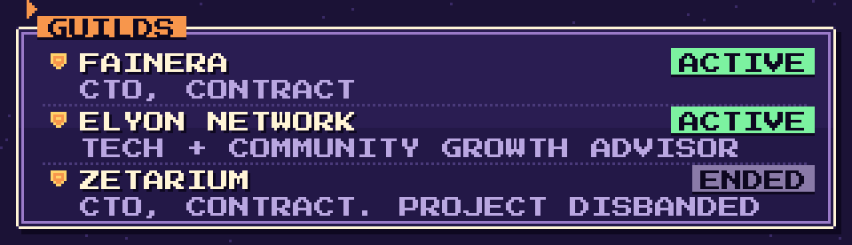
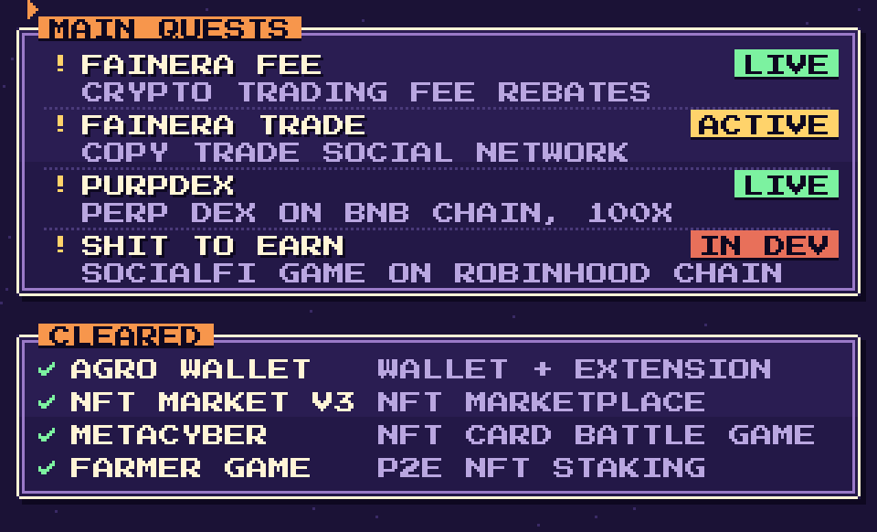

 

**Web3 product builder from Antalya.** I take products from idea to launch, A to Z, with my own crew:
smart contracts, backend, frontend, mobile, infra and the product decisions that tie them together.
CTO (contract) at FainEra, tech and community growth advisor at Elyon Network.

 

  

  

  

